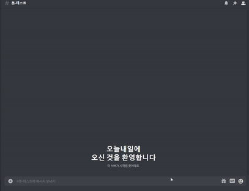
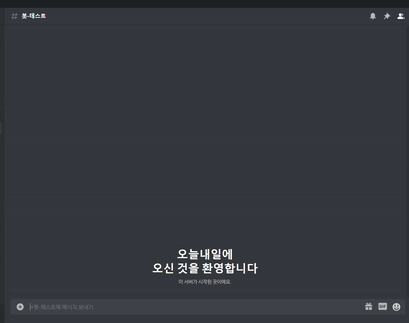

# Discord 봇 만들기

&nbsp;&nbsp; &nbsp;&nbsp;

<b>1️⃣ 해당 소스코드는 12버전대 discordjs 라이브러리를 사용하고 있어 최신버전(13버전대)과 맞지 않습니다. </b><br/>
<b>2️⃣ 동작에만 의의를 두고 만들었던 버전이라 구조는 개판입니다. (고쳐볼라 했는데 포기함) </b>

## Getting Started

`discord` 봇을 만들 수 있는 라이브러리는 `Python` 부터 시작해서 `Java`, `Javascript` 로 매우 다양한 언어에 존재한다. 하지만 `discord.js`는 `discord` 봇 만드는 라이브러리 중 가장 유명할 뿐더러 `Javascript` 연습도 할겸 이용해보았다. (추후에 벨로그에 기술하면 링크하)

1. 프로젝트 폴더를 생성하고 다음 명령어를 입력한다.

   ```shell
   > npm init
   > npm install discord.js --save
   ```

   그 외에는 자신이 사용하고 싶은 라이브러리를 사용하면 되는데 내가 사용한 라이브러리는 다음과 같다.

   ```shell
   > npm install axios --save
   > npm install cheerio --save
   > npm install nodemon --save-dev
   ```

   [axios](https://github.com/axios/axios) : 너무나도 유명한 REST API 라이브러리, 그래서 사용했는데 비동기 처리 때문에 약간 애먹었다.

   [cheerio](https://www.npmjs.com/package/cheerio) : 이번 기회에 알게된 `html` 파싱 라이브러리, 진짜 웹 데이터 모으는 사람이면 강력 추천!

   [nodemon](https://www.npmjs.com/package/nodemon) : `Ctrl+S` 저장키를 누르면 자동으로 서버를 내렸다가 올려준다. 개발할 때 너무나도 편함.

2. [`discord` 개발자 페이지](https://discord.com/developers/applications/)로 접속한다. (회원가입이 안 되어있을경우 회원가입 진행)

3. New Application 버튼을 눌러 Application 하나를 생성하고 봇 이름과 설명을 간략하게 적는다.

4. Create 버튼을 누르고 왼쪽 네비게이션바에 Bot 버튼을 눌러서 봇을 하나 생성한다.

5. TOKEN 을 복사해두고 `discord.js` 에서 로그인 할 때 사용할 수 있도록 한다.


## Demo

1. 채팅에 `.전투정보 + 로스트아크 닉네임`&nbsp;을 입력한다.

   

   

2. 채팅에 `.이벤트`&nbsp;를 입력한다.

    


## Discord.js를 이용한 봇 개발

1. [`discord.js`&nbsp;튜토리얼](https://velog.io/@junsugi/Discord.js%EB%A1%9C-Bot-%EB%A7%8C%EB%93%A4%EA%B8%B0#%EA%B0%9C%EB%B0%9C%EC%9A%A9-%EB%B4%87-%EC%83%9D%EC%84%B1%ED%95%98%EA%B8%B0)
